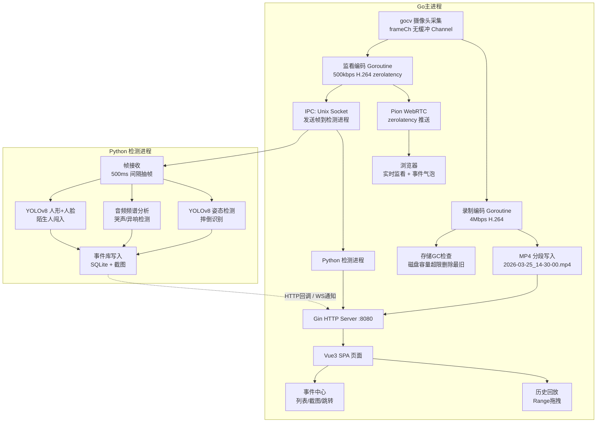

# DESIGN - 解决方案设计

## 方案选型

### 可选方案 A：单体 Goroutine Pipeline（Go全栈）
- Go主进程集成：gocv采集 + FFmpeg CGO双路编码 + Gin + Pion WebRTC + onnxruntime-go
- 所有链路在单一进程内通过 channel 传递帧

### 可选方案 B：Go + Python 分离检测进程（混合架构）⭐ 选择
- Go主进程：gocv采集 + FFmpeg CGO双路编码 + Gin + Pion WebRTC
- Python子进程：YOLOv8姿态/人形 + 音频频谱分析，通过 Unix socket / pipe 与 Go 进程通信

### 可选方案 C：完全模块化多进程
- 采集进程(Go) → 编码进程(FFmpeg) → 存储进程(Go) → WebRTC进程(Go)
- 事件检测独立服务( Python/ONNX )
- 进程间通过 gRPC / ZeroMQ 通信

---

### 选择理由（奥卡姆剃刀）

**选方案 B**。理由：

1. **规避 CGO 符号冲突**：`gocv` 和 `FFmpeg CGO` 共用同一进程存在符号冲突风险（gocv 自带 OpenCV 静态/动态库，FFmpeg CGO 也有独立 FFmpeg 库），分离进程彻底消除此风险。
2. **Python YOLOv8 生态成熟**：YOLOv8 官方 Python 库 + ONNX 推理生态完善，无需面对 `onnxruntime-go` 算子覆盖不确定性问题。音频检测（librosa / scipy）也在 Python 侧更成熟。
3. **进程隔离故障容错**：检测进程崩溃不导致录制链路中断。
4. **开发效率**：先实现 Go 核心链路（采集→录制→WebRTC），再叠加 Python 检测，独立迭代。
5. **方案 A** 的问题：单体进程需同时解决 gocv+FFmpeg 兼容、onnxruntime-go 算子两大未知风险，工期不可控。
6. **方案 C** 过度设计：多进程 + gRPC 对于单人开发过于复杂，增加调试难度和进程间通信开销。

---

## 架构设计

### 整体架构



### Go 主进程内部模块边界

```mermaid
graph LR
    subgraph capture [采集层 - goroutine]
        CA[gocv VideoCapture<br/>摄像头] --> CC[frameCh 无缓冲<br/>下游满则丢帧]
    end

    subgraph encode [编码层 - 两路 goroutine]
        CC --> RE[录制编码器<br/>h264_qsv→nvenc→libx264<br/>4Mbps, B帧启用]
        CC --> ME[监看编码器<br/>h264_qsv→nvenc→libx264<br/>500kbps, zerolatency<br/>B帧禁用]
    end

    subgraph store [存储层]
        RE --> MP4W[MP4 分段写入<br/>5min/文件]
        MP4W --> GC[存储GC<br/>检查磁盘删除最旧]
    end

    subgraph stream [流媒体层]
        ME --> WRTC[Pion WebRTC<br/>track 推送]
        ME --> IPC[Unix Socket IPC<br/>发送原始帧]
    end

    subgraph api [API 层 - Gin]
        MP4W --> FS[文件服务<br/>/api/clips]
        GC --> EV[事件查询<br/>/api/events]
        WRTC --> WS[WebSocket 信令<br/>/api/ws/signal]
        FS --> SPA[Vue3 SPA<br/>静态文件]
    end

    subgraph detection [Python 检测进程 - 独立进程]
        IPC --> DP[帧接收]
        DP --> YOLO[YOLOv8 ONNX<br/>姿态/人形]
        DP --> AUD[音频频谱<br/>哭声/异响]
        YOLO --> EVDB[事件库 SQLite<br/>时间戳+截图]
        AUD --> EVDB
    end
```



### 帧数据流协议（Go → Python IPC）

```
每 500ms 发送一帧（原始图像 bytes）：
  [4字节 int32: width]
  [4字节 int32: height]
  [4字节 int32: channel数]
  [4字节 int32: frame_type 0=RGB 1=YUV]
  [N字节: 图像数据]
  [4字节 int64: Unix timestamp ns]

Unix Socket，帧数据直接 write()，Python 侧 select/poll 超时读取。
```

### 事件库 Schema（SQLite）

```sql
CREATE TABLE events (
    id          INTEGER PRIMARY KEY AUTOINCREMENT,
    type        TEXT    NOT NULL,  -- 'fall' | 'cry' | 'noise' | 'intruder'
    timestamp   INTEGER NOT NULL,  -- Unix ns
    clip_name   TEXT,             -- 关联的录像文件名
    clip_offset INTEGER,          -- 事件在录像中的时间偏移(s)
    screenshot  TEXT,            -- 截图文件路径
    confidence  REAL,
    created_at  INTEGER
);

CREATE INDEX idx_events_timestamp ON events(timestamp);
```

---

## 执行计划

### 阶段 1：Go 核心链路（MVP）

- [ ] **创建项目目录结构**
  ```
  VisionLoop/
  ├── cmd/server/main.go          # 主入口
  ├── internal/capture/capture.go # gocv 采集
  ├── internal/encoder/encoder.go # FFmpeg CGO 硬编码
  ├── internal/mp4/mp4.go         # MP4 分段写入
  ├── internal/webrtc/webrtc.go   # Pion WebRTC
  ├── internal/ipc/socket.go      # Unix Socket IPC
  ├── internal/storage/gc.go      # 存储 GC
  ├── internal/api/server.go      # Gin HTTP 服务
  ├── web/                        # Vue3 前端静态资源
  │   ├── index.html
  │   ├── src/
  │   └── dist/ (嵌入用)
  └── detection/                  # Python 检测进程
      ├── main.py
      ├── yolo.py
      └── audio.py
  ```

- [ ] **实现 `internal/capture/capture.go`**
  - gocv 打开摄像头，返回无缓冲 `frameCh`
  - goroutine 循环 ReadFrame，写入 channel
  - 采集 goroutine 永不阻塞

- [ ] **实现 `internal/encoder/encoder.go`**
  - CGO 调用 FFmpeg 动态库（avcodec_send_frame / avcodec_receive_packet）
  - 硬编码器探测：尝试 h264_qsv → h264_nvenc → libx264
  - `EncodeOneFrame(frame, bool isRecord)`：同一帧同时发两路编码器，不阻塞

- [ ] **实现 `internal/mp4/mp4.go`**
  - AVFormatContext 封装 mp4 muxer
  - 5分钟自动切分文件，命名 `2026-03-25_14-30-00.mp4`
  - 每次写包前检查磁盘容量

- [ ] **实现 `internal/storage/gc.go`**
  - `CheckAndCleanup(maxGB float64)`：扫描 clips 目录，按时间删除最旧文件

- [ ] **实现 `internal/webrtc/webrtc.go`**
  - Pion WebRTC zerolatency 配置：`z LloydMaxQuantizer, ConstantBitRate, NoFrameDropping`
  - 接收 RTP video track，绑定监看编码器的 H.264 packet
  - 信令交换通过 Gin WS `/api/ws/signal`

- [ ] **实现 `internal/ipc/socket.go`**
  - 创建 Unix socket server（`/tmp/visionloop_det.sock`）
  - goroutine 接收 Python 检测进程的指令（如事件通知）
  - 客户端（Go侧）每 500ms 将监看帧 bytes 发往 Python 进程

- [ ] **实现 `internal/api/server.go`**
  - `GET /api/clips` → 列出 clips 目录 mp4 文件
  - `GET /api/clips/:name` → 文件 Range 服务（video.js 拖拽）
  - `GET /api/events` → SQLite 事件查询
  - `GET /api/ws/signal` → Pion 信令 WebSocket
  - `GET /` → Vue3 SPA 静态文件

### 阶段 2：Vue3 前端

- [ ] **搭建 Vue3 项目（Vite + Vue3 + TypeScript）**
  - 组件：`LiveView.vue` | `PlaybackView.vue` | `EventCenter.vue` | `SettingsView.vue`

- [ ] **`LiveView.vue` 实时监看页面**
  - 使用 `videojs-webrtc` 或原生 `RTCPeerConnection` 连接 `/api/ws/signal`
  - 事件气泡：WebSocket 接收事件推送， absolute 定位浮层显示

- [ ] **`PlaybackView.vue` 历史回放页面**
  - video.js 配置 Range 请求支持
  - 事件时间轴标注：事件图标落在进度条对应位置，点击跳转
  - `/api/clips/:name?start=offset` 支持 offset 参数快速定位

- [ ] **`EventCenter.vue` 事件中心**
  - 列表展示：时间、类型、截图缩略图
  - 点击跳转对应录像的时间点

- [ ] **`SettingsView.vue` 设置页面**
  - 存储阈值滑块（GB）
  - 检测开关（摔倒/哭声/异响/陌生人）
  - 灵敏度调节

### 阶段 3：Python 检测进程

- [ ] **`detection/main.py` 入口**
  - 连接 Unix socket 接收帧
  - 定时（500ms）送入检测 pipeline
  - 检测结果 HTTP POST 到 Go 服务写入 SQLite

- [ ] **`detection/yolo.py` YOLOv8 检测**
  - 加载 YOLOv8n-face ONNX 模型（人形+人脸）
  - 加载 YOLOv8n-pose ONNX 模型（姿态）
  - 摔倒判定：关键点高度变化 + 人体角度

- [ ] **`detection/audio.py` 音频检测**
  - 音频流混入帧：Go 进程同时采集 PCM 音频
  - 短时傅里叶变换（STFT）→ 频谱特征
  - 哭声：1-4kHz 能量异常突出
  - 异响：频谱突然变化检测（能量冲击）

- [ ] **事件截图**
  - 使用 Pillow 将检测帧保存为 JPEG
  - 截图路径存入事件库

### 阶段 4：打包与分发

- [ ] **Go 嵌入前端静态资源**
  - 使用 `go:embed` 将 `web/dist/` 嵌入二进制
  - `VisionLoop.exe` 双击启动，`:8080` 服务

- [ ] **FFmpeg DLL 打包**
  - 下载 `ffmpeg-shared.7z` 含 `avcodec-*.dll` 等
  - 放在 `VisionLoop.exe` 同目录或嵌入资源

- [ ] **Python 检测进程打包**
  - `PyInstaller --onefile detection/main.py`
  - 或用 `embed Python` + `pyinstaller` 子进程方式
  - 建议：直接用 Python 安装包方式，Go 进程 `exec.Command` 拉起

---

## 风险预判

| 风险 | 概率 | 影响 | 应对 |
|------|------|------|------|
| gocv 与 FFmpeg CGO 符号冲突（方案A放弃，此风险消除） | - | - | 方案 B 已消除 |
| Python 检测进程 IPC 超时/崩溃 | 中 | 低 | Go 侧检测 socket 断开不影响录制；进程崩溃后自动重启 |
| FFmpeg CGO 交叉编译（Windows 打包） | 高 | 中 | 先在 Linux 用 `xgo` 交叉编译验证；或先用 `mingw` 在 Linux 交叉编译 |
| Pion WebRTC 在部分浏览器无法直连 | 中 | 中 | 未来可叠加 SimpleWebRTC/gRPC；初期仅支持同网络直连 |
| YOLOv8 ONNX 模型推理速度不足 | 低 | 中 | 降级为 YOLOv8n-tiny；或增加抽帧间隔至 1s |
| MP4 Range 拖拽与 video.js 兼容性问题 | 低 | 中 | 验证 Chrome/Firefox/Safari；Edge 使用 Chromium 内核应兼容 |
| 磁盘写满导致录像中断 | 低 | 高 | GC 每次写包前检查，提前删除至阈值以下 |
| 音频采集与视频帧同步 | 中 | 中 | 音频帧携带相同 Unix timestamp，Python 侧对齐处理 |

---

*设计完成时间: 2026-03-25*
*下一阶段: DO - 逐步执行实现*
